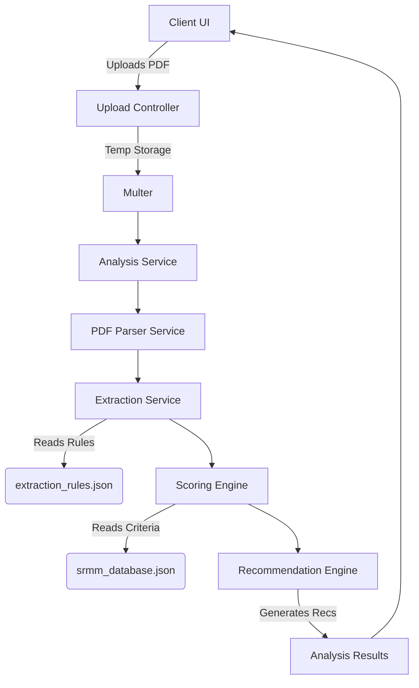

# BRSR SRMM Scoring & Analysis Platform

A full-stack, enterprise-grade web application to parse, extract, and evaluate Business Responsibility and Sustainability Reports (BRSR) against the SEBI SRMM scoring criteria.

## Features

- **Automated PDF Parsing**: Upload BRSR PDF reports, which are parsed and analyzed.
- **Rule-Based Extraction**: Configurable rules extract sections, indicators, and metrics.
- **JSON-Driven Evaluation**: Extracting logic, scoring criteria, weights, and recommendations are fully driven by externalized JSON rules (`extraction_rules.json` and `srmm_database.json`).
- **Interactive Dashboards**: Deep insights and maturity models using responsive frontend UI.
- **Microservice-Ready Architecture**: Client and Server split with Monorepo structure using a shared typing package.

## Tech Stack

- **Frontend**: React 19, Vite, TypeScript, TailwindCSS, shadcn/ui, Recharts.
- **Backend**: Node.js 22, Express.js, Multer, `pdf-parse`.
- **Shared**: Zod validation, shared TypeScript definitions.

## Architecture Flow



## Setup & Running

1. **Install Dependencies**: `npm install`
2. **Build Workspace**: `npm run build`
3. **Start Server**: `npm run start --workspace=@brsr-srmm/server`
4. **Start Client**: `npm run dev --workspace=@brsr-srmm/client`

## Docker Compose

To deploy the entire stack (Backend + Frontend with Nginx):

```bash
docker-compose up -d --build
```

The frontend will be exposed on port `8080`, and the backend on `3000`.

## Architecture Details
The system has been heavily refactored from hardcoded heuristics to a completely data-driven approach, reducing brittleness and scaling up maintainability without touching source code whenever BRSR standards change.
